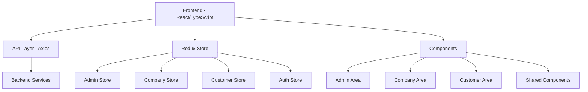

# 🎟️ Coupon System - Phase 3 Frontend

<div align="center">


**A comprehensive coupon management system with role-based access control**

[🚀 Live Demo](#) • [📖 Documentation](#getting-started) • [🐛 Report Bug](https://github.com/noamshalev4/Coupon-System-Phase-3-FE/issues) • [💡 Request Feature](https://github.com/noamshalev4/Coupon-System-Phase-3-FE/issues)

</div>

---

## 📋 Table of Contents

- [🎯 About](#about)
- [✨ Features](#features)
- [🏗️ System Architecture](#system-architecture)
- [🚀 Getting Started](#getting-started)
- [📱 User Roles & Permissions](#user-roles--permissions)
- [🛠️ Tech Stack](#tech-stack)
- [📁 Project Structure](#project-structure)
- [🔧 Development](#development)
- [🤝 Contributing](#contributing)
- [📄 License](#license)
- [👥 Authors](#authors)

---

## 🎯 About

The **Coupon System Phase 3** is a modern, full-stack web application that provides a comprehensive platform for managing digital coupons. Built with React and TypeScript, this system offers role-based access control for administrators, companies, and customers, enabling efficient coupon creation, management, and redemption.

### 🌟 Key Highlights

- **Role-Based Architecture**: Separate interfaces for Admin, Company, and Customer roles
- **Real-Time Management**: Live coupon tracking and inventory management
- **Modern UI/UX**: Built with Material-UI for a sleek, responsive design
- **Type Safety**: Full TypeScript implementation for robust code quality
- **State Management**: Redux Toolkit for predictable state management

---

## ✨ Features

### 👑 Admin Features
- **Company Management**: Create, update, and delete company accounts
- **Customer Management**: Manage customer accounts and permissions
- **System Overview**: Monitor system-wide statistics and activities
- **User Administration**: Control access levels and permissions

### 🏢 Company Features
- **Coupon Creation**: Design and publish new coupon campaigns
- **Inventory Management**: Track coupon quantities and availability
- **Analytics Dashboard**: Monitor coupon performance and usage statistics
- **Company Profile**: Manage company information and branding

### 👤 Customer Features
- **Coupon Browsing**: Explore available coupons by category
- **Purchase System**: Secure coupon purchasing and redemption
- **Personal Collection**: View and manage purchased coupons
- **Profile Management**: Update personal information and preferences

### 🔄 General Features
- **Responsive Design**: Optimized for desktop, tablet, and mobile devices
- **Real-Time Notifications**: Toast notifications for user actions
- **Form Validation**: Comprehensive input validation with Zod
- **Error Handling**: Graceful error management and user feedback
- **Routing**: Single-page application with React Router

---

## 🏗️ System Architecture



---

## 🚀 Getting Started

### 📋 Prerequisites

Before you begin, ensure you have the following installed:

- **Node.js** (v16.0 or higher)
- **npm** or **yarn**
- **Git**

### 🔧 Installation

1. **Clone the repository**
   ```bash
   git clone https://github.com/noamshalev4/Coupon-System-Phase-3-FE.git
   cd Coupon-System-Phase-3-FE
   ```

2. **Navigate to the frontend directory**
   ```bash
   cd coupon-system-3-fe
   ```

3. **Install dependencies**
   ```bash
   npm install
   ```

4. **Start the development server**
   ```bash
   npm run dev
   ```

5. **Open your browser**
   ```
   Navigate to http://localhost:5173
   ```

### 🌐 Production Build

```bash
# Build for production
npm run build

# Preview production build
npm run preview
```

---

## 📱 User Roles & Permissions

| Role | Access Level | Capabilities |
|------|--------------|--------------|
| **Admin** | Full System Access | Manage companies, customers, and system settings |
| **Company** | Company-Specific | Create/manage coupons, view analytics |
| **Customer** | Personal Account | Browse/purchase coupons, manage profile |
| **Guest** | Public Access | View available coupons (read-only) |

---

## 🛠️ Tech Stack

### Frontend Core
- **React 18.3.1** - UI library
- **TypeScript 5.6.2** - Type-safe JavaScript
- **Vite 6.0.1** - Build tool and dev server

### UI & Styling
- **Material-UI 6.2.1** - Component library
- **Emotion** - CSS-in-JS styling
- **React Icons** - Icon components

### State Management
- **Redux Toolkit 2.2.6** - State management
- **React Redux 9.1.2** - React bindings for Redux

### Routing & Navigation
- **React Router DOM 6.24.1** - Client-side routing

### Forms & Validation
- **React Hook Form 7.54.2** - Form handling
- **Zod 3.24.1** - Schema validation
- **Hookform Resolvers** - Form validation integration

### HTTP & API
- **Axios 1.7.2** - HTTP client

### Utilities
- **Moment.js 2.30.1** - Date manipulation
- **React Toastify 10.0.5** - Notifications

### Development Tools
- **ESLint** - Code linting
- **TypeScript ESLint** - TypeScript-specific linting

---

## 📁 Project Structure

```
coupon-system-3-fe/
├── public/                     # Static assets
│   ├── vite.svg
│   └── page_not_found.webp
├── src/
│   ├── Assets/                 # Application assets
│   ├── Components/             # React components
│   │   ├── AdminArea/          # Admin-specific components
│   │   ├── CompanyArea/        # Company-specific components
│   │   ├── CustomerArea/       # Customer-specific components
│   │   ├── Layout/             # Layout components
│   │   └── Shared/             # Reusable components
│   ├── Enums/                  # TypeScript enums
│   │   ├── Category.ts
│   │   └── ClientType.ts
│   ├── Model/                  # TypeScript interfaces
│   │   ├── CompanyModel.ts
│   │   ├── CouponModel.ts
│   │   ├── CustomerModel.ts
│   │   └── LoginModel.ts
│   ├── Redux/                  # State management
│   │   ├── AdminStore.ts
│   │   ├── AuthStore.ts
│   │   ├── CompanyStore.ts
│   │   └── CustomerStore.ts
│   ├── Service/                # API services
│   │   ├── AdminService.ts
│   │   ├── CompanyService.ts
│   │   ├── CustomerService.ts
│   │   └── LoginService.ts
│   ├── App.tsx                 # Main App component
│   └── main.tsx                # Application entry point
├── package.json                # Dependencies and scripts
├── tsconfig.json              # TypeScript configuration
├── vite.config.ts             # Vite configuration
└── eslint.config.js           # ESLint configuration
```

---

## 🔧 Development

### 🎯 Available Scripts

| Command | Description |
|---------|-------------|
| `npm start` | Start development server |
| `npm run dev` | Start development server (alias) |
| `npm run build` | Build for production |
| `npm run lint` | Run ESLint |
| `npm run preview` | Preview production build |

### 🧪 Code Quality

- **TypeScript**: Full type safety throughout the application
- **ESLint**: Consistent code style and error prevention
- **Prettier**: Code formatting (recommended)

### 🔍 Development Guidelines

1. **Component Structure**: Follow the established component organization
2. **Type Safety**: Always use TypeScript interfaces for props and data
3. **State Management**: Use Redux for global state, local state for component-specific data
4. **API Calls**: Utilize the service layer for all backend communications
5. **Error Handling**: Implement proper error boundaries and user feedback

---

## 🤝 Contributing

We welcome contributions! Please see our [Contributing Guidelines](CONTRIBUTING.md) for details.

### 🚀 Quick Contribution Steps

1. Fork the repository
2. Create your feature branch (`git checkout -b feature/AmazingFeature`)
3. Commit your changes (`git commit -m 'Add some AmazingFeature'`)
4. Push to the branch (`git push origin feature/AmazingFeature`)
5. Open a Pull Request

---

## 📄 License

This project is licensed under the MIT License - see the [LICENSE](LICENSE) file for details.

---

## 👥 Authors

**Noam Shalev** - *Initial work* - [@noamshalev4](https://github.com/noamshalev4)

---

<div align="center">

### 🌟 Show your support

Give a ⭐️ if this project helped you!

[](https://github.com/noamshalev4)
[](https://github.com/noamshalev4/Coupon-System-Phase-3-FE/stargazers)

</div>

---

<div align="center">
  <sub>Built with ❤️ by <a href="https://github.com/noamshalev4">Noam Shalev</a></sub>
</div>